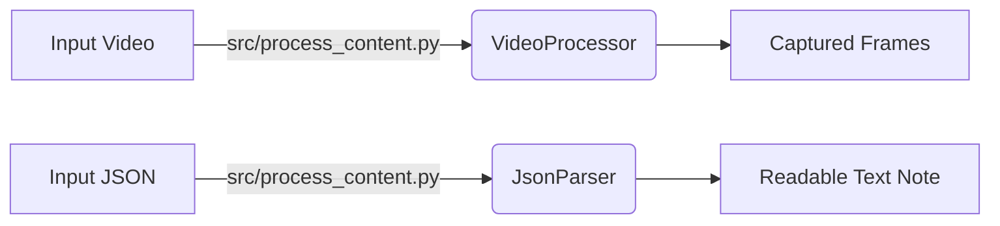

# 🤝 Collaboration Readiness Review

## 1. Status Check

`capture_test` 폴더의 코드들은 이제 **상대 경로(Relative Paths)**를 사용하여 어떤 환경에서도 실행 가능하도록 수정되었습니다.

### ✅ Fixes Applied

- **Hardcoded Paths Removed**: `C:\Users\irubw\...`와 같은 절대 경로를 모두 `data/input/`, `data/output/`과 같은 상대 경로로 변경했습니다.
- **Directory Safety**: 출력 폴더가 없을 경우 자동으로 생성하거나, 입력 파일이 없을 경우 안내 메시지를 출력하도록 개선했습니다.

---

## 2. Integration Plan (Next Steps)

현재 `capture_test`에 있는 파일들은 `Lecture-Note-AI` 프로젝트의 정식 모듈로 통합되어야 합니다.

### 📂 Recommended Structure

```text
Lecture-Note-AI/
├── src/
│   ├── capture/
│   │   └── video_processor.py  <-- (Move from capture_test)
│   ├── audio/
│   │   └── audio_processor.py  <-- (Move from capture_test)
│   └── utils/
│       └── mask_video.py       <-- (Move from capture_test)
```

### 🚀 Action Items

1. **Move Files**: 위 구조대로 파일을 이동시키십시오.
2. **Update Imports**: 이동 후 `import` 경로가 깨질 수 있으므로, `src.capture.video_processor`와 같이 패키지 경로를 수정해야 합니다.
3. **Merge Dependencies**: `capture_test/requirements.txt`의 내용을 `Lecture-Note-AI/requirements.txt`에 병합하십시오.

---

## 3. How to Test (Locally)

테스트를 위해서는 프로젝트 루트에 `data` 폴더를 만들고 영상을 넣어야 합니다.

```bash
mkdir -p data/input
# 테스트 영상(dirty_ex2.mp4 등)을 data/input에 복사
python capture_test/video_processor.py
```

---

## 4. Module Connection & Data Flow (2025-12-01 Update)

현재 구현된 `Lecture-Note-AI`의 모듈 연결 방식과 데이터 흐름은 다음과 같습니다.

### 🏗 Architecture

1. **Orchestrator (`src/process_content.py`)**
    - **역할**: 전체 파이프라인의 컨트롤 타워입니다.
    - **동작**: `data/input` 폴더의 영상과 `data/output` 폴더의 JSON 파일을 스캔하고, 적절한 처리 모듈(`JsonParser`, `VideoProcessor`)을 호출합니다.

2. **Data Processing (`src/data/json_parser.py`)**
    - **역할**: ClovaSpeech의 STT 결과(JSON)를 가독성 있는 텍스트로 변환합니다.
    - **연결**: `process_content.py`에서 임포트되어 사용됩니다. JSON 파일명을 받아 파싱 후 텍스트 파일을 생성합니다.

3. **Vision Processing (`src/capture/video_processor.py`)**
    - **역할**: 강의 영상에서 화면이 전환되는 시점을 감지하여 키프레임을 캡처합니다. (기본 기능: Scene Detection -> Keyframe Capture)
    - **연결**: `process_content.py`에서 임포트되어 사용됩니다. 영상 경로를 받아 프레임 추출 작업을 수행합니다.

### [[장면 변환 프레임 캡처]]

### 🔄 Data Flow



### 🛡 Git Configuration (Collaboration)

협업 시 불필요한 파일이 공유되지 않도록 `.gitignore`를 설정했습니다.

- **Excluded**:
  - `OPTIMIZED_PROMPT.md`: 에이전트 프롬프트 최적화 로그
  - `SUMMARY.md`: 작업 요약 로그
  - `.env`: 환경 변수 파일
  - `__pycache__`: 파이썬 캐시 파일
  - `*_readable.txt`, `*_frames/`: 로컬 테스트 결과물
