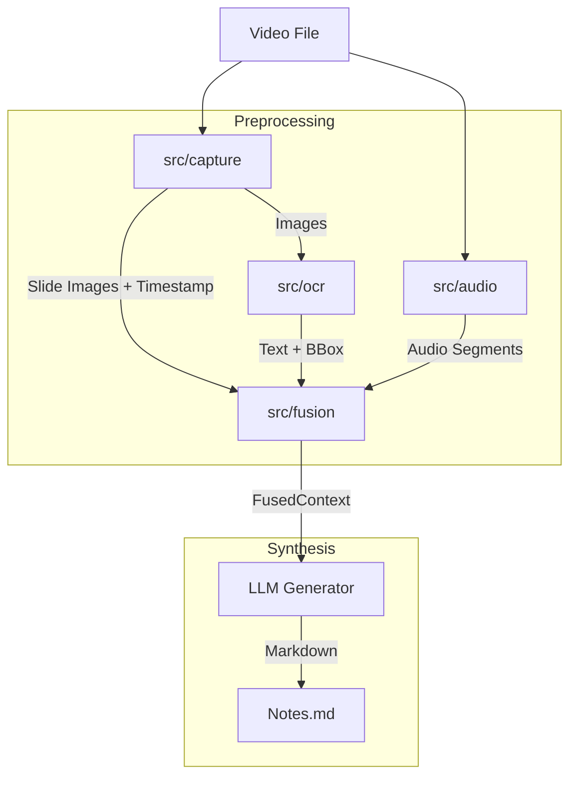

# 🏗️ Screentime-MVP Module Structure

## 1. Directory Structure Tree

```text
Lecture-Note-AI/
├── main.py                 # Application Entry Point
├── TODO.md                 # Task List
├── requirements.txt        # Dependencies
└── src/
    ├── audio/              # Speech-to-Text Module
    │   ├── __init__.py
    │   └── speech_client.py
    ├── capture/            # Video Processing & Slide Extraction
    │   ├── __init__.py
    │   └── video_processor.py
    ├── common/             # Shared Data Models & Utils
    │   ├── __init__.py
    │   └── schemas.py
    ├── fusion/             # Data Alignment & LLM Generation
    │   ├── __init__.py
    │   ├── data_fuser.py
    │   └── llm_generator.py
    └── ocr/                # Optical Character Recognition
        ├── __init__.py
        └── ocr_engine.py
```

---

## 2. Module Description

### 2.1. `src/common` (Shared Core)

- **Role**: 모든 모듈에서 공통으로 사용하는 데이터 모델(Pydantic Schemas)을 정의하여 데이터 일관성을 보장합니다.
- **Key Classes**:
  - `SlideData`: 슬라이드 이미지 경로 및 타임스탬프.
  - `AudioSegment`: STT 결과 (시작/종료 시간, 텍스트).
  - `OcrBox`, `OcrResult`: OCR 감지 영역 및 텍스트.
  - `FusedContext`: 슬라이드 + 오디오 + OCR이 결합된 최종 컨텍스트.

### 2.2. `src/capture` (Vision)

- **Role**: 입력 비디오에서 슬라이드가 전환되는 시점을 감지하고 이미지를 추출합니다.
- **Key Classes**:
  - `SlideExtractor`: 히스토그램 비교(`cv2.calcHist`, `cv2.compareHist`)를 통해 장면 전환을 감지하고 키프레임을 저장합니다.
- **Dependencies**: `opencv-python`, `numpy`

### 2.3. `src/audio` (Hearing)

- **Role**: 비디오의 오디오 트랙을 텍스트로 변환(STT)합니다.
- **Key Classes**:
  - `ClovaSpeechClient`: Naver Clova Speech API와 통신하여 오디오 파일을 업로드하고 인식 결과를 받아옵니다.
- **Dependencies**: `requests`

### 2.4. `src/ocr` (Reading)

- **Role**: 추출된 슬라이드 이미지에서 텍스트, 수식, 그래프 정보를 읽어냅니다.
- **Key Classes**:
  - `PaddleHintExtractor`: PaddleOCR을 사용하여 이미지 내 텍스트와 바운딩 박스를 추출합니다.
- **Dependencies**: `paddleocr`

### 2.5. `src/fusion` (Synthesis)

- **Role**: 이종 데이터(이미지, 텍스트, 오디오)를 시간 축을 기준으로 정렬하고, LLM을 통해 최종 노트를 생성합니다.
- **Key Classes**:
  - `ContextAligner`: 슬라이드 타임스탬프를 기준으로 오디오 세그먼트를 매핑합니다.
  - `NoteGenerator`: 정렬된 데이터를 프롬프트로 변환하여 LLM(Gemini 등)에 요청을 보냅니다.
- **Dependencies**: `google-generativeai` (assumed)

---

## 3. Data Flow Diagram



---

## 4. Architectural Improvements (Code Audit)

1. **Dependency Injection**: 현재 `main.py`에서 모든 객체를 직접 생성하고 있습니다. 설정(Config)이나 의존성을 주입받는 구조로 변경하면 테스트와 확장이 용이해집니다.
2. **Error Handling**: 각 모듈(`capture`, `audio` 등)의 예외 처리가 개별적으로 이루어지고 있습니다. 중앙화된 에러 핸들링 전략이 필요합니다.
3. **Async Processing**: 오디오 업로드나 OCR 처리 등 I/O 바운드 작업은 비동기(`asyncio`)로 처리하면 전체 파이프라인 속도를 높일 수 있습니다.
