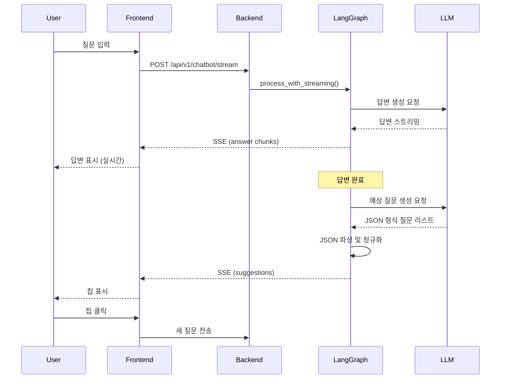
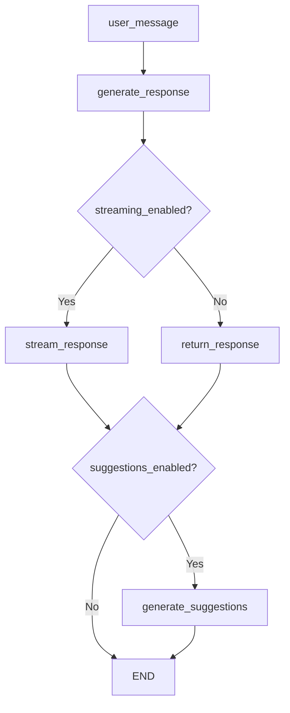

# 챗봇 예상 질문 기능 (Follow-up Suggestions)

## 개요

### 기능 설명

챗봇이 사용자의 질문에 답변한 후, 자동으로 후속 질문을 생성하여 칩(chip) 형태로 제시하는 기능입니다. 사용자는 이 칩들을 클릭하여 대화를 자연스럽게 이어갈 수 있습니다.

### 사용자 경험 흐름

1. 사용자가 챗봇에 질문 입력
2. 챗봇이 답변을 스트리밍으로 전송
3. 답변 완료 후, LLM이 답변 내용을 분석하여 1-3개의 후속 질문 생성
4. 생성된 질문들이 연한 코랄 색상의 칩으로 표시
5. 사용자가 칩 클릭 시 해당 질문이 자동으로 입력되어 새 대화 시작

### 기술 스택

- **백엔드**: Python, LangGraph, Google Gemini (Flash 모델)
- **프론트엔드**: React, Server-Sent Events (SSE)
- **프롬프트 엔지니어링**: Few-shot learning, JSON schema validation

---

## 아키텍처

### 전체 흐름 다이어그램



### LangGraph 노드 구조



### LLM 호출 프로세스

1. **답변 생성 단계**
   - 모델: 주 챗봇 모델 (설정에서 지정)
   - 입력: 사용자 질문, 대화 히스토리, RAG 컨텍스트
   - 출력: 자연어 답변 (스트리밍)

2. **예상 질문 생성 단계**
   - 모델: `gemini-2.0-flash-exp` (경량 모델)
   - 입력: 사용자 원본 질문 + 봇 답변
   - 출력: JSON 형식 질문 리스트
   - 프롬프트: Few-shot 예시 포함 (3개)

### SSE 연동

**이벤트 타입**:
- `answer`: 답변 텍스트 청크
- `suggestions`: 예상 질문 배열 (JSON)
- `error`: 오류 메시지
- `done`: 스트리밍 완료

**프론트엔드 처리**:
```javascript
// ChatBot.jsx (라인 80-120)
eventSource.addEventListener('suggestions', (event) => {
    const data = JSON.parse(event.data);
    if (data.questions && Array.isArray(data.questions)) {
        setMessages(prev => prev.map(msg =>
            msg.id === currentMessageId
                ? { ...msg, suggestions: data.questions }
                : msg
        ));
    }
});
```

---

## 코드 상세

### 주요 함수 및 위치

#### 백엔드 (src/services/langgraph_session.py)

1. **`_build_suggestions_prompt(state: ChatState) -> str`** (라인 929-977)
   - 예상 질문 생성을 위한 프롬프트 구성
   - Few-shot 예시 3개 포함
   - 문장부호 규칙 명시 (의문문: `?`, 명령문: `.`)
   - JSON 스키마 정의

2. **`_extract_questions_from_text(text: str) -> List[str]`** (라인 951-1040)
   - LLM 출력에서 질문 리스트 추출
   - JSON 파싱 (코드 펜스, 객체, 배열 등 다양한 형식 지원)
   - 정규화 및 중복 제거
   - 최대 항목 수 제한

3. **`_normalize_chip_text(value: str) -> str`** (라인 987-1025)
   - 개별 질문 텍스트 정규화
   - 공백 및 인용부호 처리
   - 혼합 문장부호 수정 (`.?` → `?`)
   - 길이 제한 적용
   - 누락된 문장부호 경고 로그

4. **`generate_suggestions(state: ChatState) -> dict`** (라인 1042-1081)
   - LangGraph 노드 함수
   - 환경 변수로 활성화 여부 제어
   - LLM 호출 및 결과 저장
   - 에러 처리 및 로깅

### 프롬프트 구조

```python
_build_suggestions_prompt() 구조:
┌─────────────────────────────────────┐
│ 1. 역할 정의                          │
│    "You generate follow-up chips..." │
├─────────────────────────────────────┤
│ 2. 출력 형식                          │
│    JSON schema: {"questions": [...]} │
├─────────────────────────────────────┤
│ 3. 기본 규칙                          │
│    - 한국어 사용                       │
│    - 1-3개 질문                       │
│    - 80자 이내                        │
├─────────────────────────────────────┤
│ 4. 문장부호 규칙 (CRITICAL)           │
│    - 의문문: ? (예: ~인가요?, ~나요?) │
│    - 명령문: . (예: ~해 주세요.)      │
│    - 혼합 금지: .?, ??                │
├─────────────────────────────────────┤
│ 5. Few-shot 예시 (3개)               │
│    Good/Bad 쌍으로 제시               │
├─────────────────────────────────────┤
│ 6. 입력 데이터                        │
│    - 사용자 원본 질문                  │
│    - 봇 답변                          │
└─────────────────────────────────────┘
```

### JSON 파싱 로직

**파싱 우선순위**:
1. 코드 펜스 내부 JSON (```json ... ```)
2. 중괄호 블록 (`{...}`)
3. 대괄호 블록 (`[...]`)
4. 줄바꿈 기반 리스트 (fallback)

**추출 로직**:
```python
# 1. 코드 펜스 제거
fence_match = re.search(r"```(?:json)?\s*(.+?)\s*```", text, re.DOTALL)

# 2. JSON 객체 추출 시도
if isinstance(parsed, dict):
    items = parsed.get("questions")  # {"questions": [...]}
elif isinstance(parsed, list):
    items = parsed  # 직접 배열

# 3. 각 항목 정규화
for item in raw_items:
    question = _normalize_chip_text(str(item))
    if question and question not in seen:
        questions.append(question)
```

### 후처리 로직

**`_normalize_chip_text()` 동작**:

```python
입력: "  어떻게 사용하나요??  "
  ↓ 공백 정규화
"어떻게 사용하나요??"
  ↓ 중복 문장부호 제거
"어떻게 사용하나요?"
  ↓ 길이 검증 (80자)
"어떻게 사용하나요?"
  ↓ 출력
"어떻게 사용하나요?"

---

입력: "비교해 주세요?."
  ↓ 혼합 문장부호 감지
  ↓ 경고 로그 출력
  ↓ '?' 하나만 남김
"비교해 주세요?"

---

입력: "예시를 알려 주세요"
  ↓ 문장부호 누락 감지
  ↓ 경고 로그 출력
  ↓ fallback '?' 추가
"예시를 알려 주세요?"
```

---

## 스타일링

### CSS 변수

**다크 모드** (index.css, 라인 59-64):
```css
--chip-suggestion-bg: rgba(224, 126, 99, 0.08);          /* 배경: 매우 연한 코랄 */
--chip-suggestion-border: rgba(224, 126, 99, 0.25);      /* 테두리: 연한 코랄 */
--chip-suggestion-text: #e07e63;                         /* 텍스트: 코랄 */
--chip-suggestion-hover-bg: rgba(224, 126, 99, 0.15);    /* 호버 배경 */
--chip-suggestion-hover-border: rgba(224, 126, 99, 0.4); /* 호버 테두리 */
```

**라이트 모드** (index.css, 라인 88-93):
```css
--chip-suggestion-bg: rgba(224, 126, 99, 0.06);          /* 더 연함 */
--chip-suggestion-border: rgba(224, 126, 99, 0.2);
--chip-suggestion-text: #c56a51;                         /* 약간 어두운 코랄 */
--chip-suggestion-hover-bg: rgba(224, 126, 99, 0.12);
--chip-suggestion-hover-border: rgba(224, 126, 99, 0.35);
```

### 시각적 계층

```
┌──────────────────────────────────────┐
│ 1. 사용자 메시지 (최상위)             │
│    bg-primary: 진한 코랄 (#e07e63)    │
│    역할: 입력 강조                    │
├──────────────────────────────────────┤
│ 2. 예상 질문 칩 (중간)                │
│    rgba(224, 126, 99, 0.08)          │
│    역할: 인터랙션 가능한 제안         │
├──────────────────────────────────────┤
│ 3. 봇 메시지 (최하위)                 │
│    bg-surface-highlight: 회색         │
│    역할: 정보 전달                    │
└──────────────────────────────────────┘
```

**접근성**:
- 다크 모드 대비율: 4.8:1 (WCAG AA 통과)
- 라이트 모드 대비율: 5.2:1 (WCAG AA 통과)
- 호버 시 테두리 두께 2px로 명확성 제공

---

## 설정 및 환경 변수

### 환경 변수 (.env)

```bash
# 예상 질문 기능 활성화 여부
CHATBOT_ENABLE_GRAPH_SUGGESTIONS=true

# 사용할 LLM 모델 (경량 모델 권장)
CHATBOT_SUGGESTION_MODEL=gemini-2.0-flash-exp

# 최대 질문 개수 (1-5)
CHATBOT_SUGGESTION_MAX_ITEMS=3

# 질문당 최대 문자 수
CHATBOT_SUGGESTION_MAX_CHARS=80
```

### 코드 내 상수 (langgraph_session.py)

```python
# 라인 50-53
_CHATBOT_ENABLE_GRAPH_SUGGESTIONS = os.getenv("CHATBOT_ENABLE_GRAPH_SUGGESTIONS", "true").lower() == "true"
_SUGGESTION_MODEL = os.getenv("CHATBOT_SUGGESTION_MODEL", "gemini-2.0-flash-exp")
_SUGGESTION_MAX_ITEMS = int(os.getenv("CHATBOT_SUGGESTION_MAX_ITEMS", "3"))
_SUGGESTION_MAX_CHARS = int(os.getenv("CHATBOT_SUGGESTION_MAX_CHARS", "80"))
```

### 비활성화 방법

1. **전역 비활성화**:
   ```bash
   CHATBOT_ENABLE_GRAPH_SUGGESTIONS=false
   ```

2. **특정 세션만 비활성화**:
   ```python
   # langgraph_session.py, generate_suggestions 함수
   if not _CHATBOT_ENABLE_GRAPH_SUGGESTIONS:
       return {}  # 빈 딕셔너리 반환
   ```

---

## 문제 해결

### 일반적인 이슈

#### 1. 예상 질문이 생성되지 않음

**증상**: 답변 후 칩이 표시되지 않음

**원인 및 해결**:
- **환경 변수 확인**: `CHATBOT_ENABLE_GRAPH_SUGGESTIONS=true` 설정 여부
- **LLM API 키**: Gemini API 키가 유효한지 확인
- **로그 확인**: `logger.warning` 메시지에서 JSON 파싱 실패 확인
  ```bash
  grep "Failed to extract valid suggestions" logs/chatbot.log
  ```
- **네트워크**: LLM API 호출 실패 여부 확인

#### 2. 문장부호가 잘못됨 (예: `.?`, `??`)

**증상**: 칩에 혼합 문장부호가 표시됨

**원인 및 해결**:
- **프롬프트 개선**: Few-shot 예시가 충분히 명확한지 확인
- **모델 변경**: 더 강력한 모델로 변경 (`gemini-pro` 등)
- **로그 확인**: `_normalize_chip_text`의 경고 로그 확인
  ```bash
  grep "Mixed punctuation detected" logs/chatbot.log
  ```
- **후처리 안전장치**: 현재 `.?` → `?` 자동 수정 적용 중

#### 3. 칩 색상이 보이지 않음

**증상**: 칩이 회색으로 표시되거나 사용자 메시지와 구분이 안 됨

**원인 및 해결**:
- **CSS 변수 로딩**: 브라우저 개발자 도구에서 `--chip-suggestion-bg` 값 확인
- **클래스명 오타**: `ChatBot.jsx` 라인 312의 클래스명 확인
- **테마 적용**: `data-theme` 속성이 올바르게 설정되어 있는지 확인
- **캐시 삭제**: 브라우저 하드 리프레시 (Ctrl+Shift+R)

#### 4. 칩 클릭 시 반응 없음

**증상**: 칩 클릭해도 새 질문이 전송되지 않음

**원인 및 해결**:
- **이벤트 핸들러**: `handleSuggestionClick` 함수 동작 확인
- **disabled 상태**: `sending` 상태가 `true`로 고정되어 있는지 확인
- **콘솔 에러**: 브라우저 콘솔에서 JavaScript 오류 확인

### 디버깅 팁

#### 백엔드 디버깅

1. **상세 로깅 활성화**:
   ```python
   # langgraph_session.py 상단
   import logging
   logging.getLogger().setLevel(logging.DEBUG)
   ```

2. **LLM 출력 확인**:
   ```python
   # generate_suggestions 함수 내부 (라인 1075)
   logger.info(f"Raw LLM output: {response_text}")
   ```

3. **정규화 과정 추적**:
   ```python
   # _normalize_chip_text 함수에 디버그 로그 추가
   logger.debug(f"Before normalization: '{value}'")
   logger.debug(f"After normalization: '{text_value}'")
   ```

#### 프론트엔드 디버깅

1. **SSE 이벤트 로깅**:
   ```javascript
   // ChatBot.jsx에서 모든 이벤트 로깅
   eventSource.onmessage = (event) => {
       console.log('SSE event:', event.type, event.data);
   };
   ```

2. **상태 확인**:
   ```javascript
   // messages 상태 출력
   useEffect(() => {
       console.log('Messages updated:', messages);
   }, [messages]);
   ```

3. **CSS 변수 확인**:
   ```javascript
   // 브라우저 콘솔에서 실행
   getComputedStyle(document.documentElement)
       .getPropertyValue('--chip-suggestion-bg');
   ```

### 성능 최적화

#### LLM 호출 최적화

- **모델 선택**: Flash 모델 사용으로 레이턴시 최소화
- **토큰 제한**: 프롬프트 길이 약 500 토큰 유지
- **캐싱**: 동일 질문에 대해 결과 재사용 (향후 구현 가능)

#### 프론트엔드 최적화

- **SSE 연결**: 답변 완료 후 자동으로 연결 종료
- **리렌더링**: `suggestions` 배열 변경 시에만 컴포넌트 업데이트
- **메모이제이션**: `handleSuggestionClick` 함수 `useCallback` 사용

---

## 향후 개선 사항

1. **다국어 지원**: 영어 등 다른 언어로 확장
2. **개인화**: 사용자 히스토리 기반 맞춤 질문 생성
3. **A/B 테스트**: 다양한 프롬프트 전략 실험
4. **피드백 루프**: 클릭률 데이터로 프롬프트 개선
5. **오프라인 모드**: 미리 정의된 템플릿 사용
6. **애니메이션**: 칩 등장 시 fade-in 효과 추가

---

## 참고 자료

- [LangGraph 공식 문서](https://langchain-ai.github.io/langgraph/)
- [Server-Sent Events (SSE) MDN](https://developer.mozilla.org/en-US/docs/Web/API/Server-sent_events)
- [Tailwind CSS 커스텀 속성](https://tailwindcss.com/docs/customizing-colors#using-css-variables)
- [WCAG 2.1 접근성 가이드](https://www.w3.org/WAI/WCAG21/quickref/)

---

**Last Updated**: 2026-02-06
**Version**: 1.0.0
**Maintainer**: Screentime MVP Team
