# Re:View Current Pipeline Timeline (Code-Accurate)

Last updated: 2026-02-05

## Scope
- 이 문서는 **현재 코드 기준 실제 동작**만 정리합니다.
- 기준 파일:
  - `src/run_pipeline_demo.py`
  - `src/run_preprocess_pipeline.py`
  - `src/run_process_pipeline.py`
  - `src/pipeline/stages.py`

## Mode Matrix
| 실행 모드 | 실제 동작 |
|---|---|
| Demo 기본(Local) | `Preprocess` 완료 후 `Process` 시작 (순차) |
| Demo `--use-db` | `Process(continuous)` 먼저 시작 + `Preprocess(db-sync)` 동시 시작 |

Note:
- 아래 Gantt의 시간값(ms)은 **코드 순서/의존성 표현용 예시값**입니다.
- 실제 소요 시간은 입력 영상 길이, API 응답, 설정(`batch_size`, `poll_interval`)에 따라 달라집니다.

## 1) Demo 기본(Local) 타임라인 

```mermaid
%%{init: {"themeVariables": {
  "activeTaskBkgColor": "#1E88E5",
  "activeTaskBorderColor": "#1565C0",
  "doneTaskBkgColor": "#9E9E9E",
  "doneTaskBorderColor": "#616161"
}}}%%
gantt
    title Current: Local Mode (Preprocess -> Process)
    dateFormat x
    axisFormat %M:%S

    section Pre-A (Audio/STT)
    Audio Extract*                          :active, l_pa1, 0, 8000
    STT*                                    :active, l_pa2, 8000, 20000

    section Pre-B (Capture)
    Capture*                                :active, l_pb1, 0, 90000

    section Process Start (after preprocess done)
    wait preprocess done                    :done, l_w0, 0, 90000
    load local artifacts                    :active, l_i0, 90000, 93000

    section Batch-1 (local)
    VLM*                                    :active, l_b1_v, 93000, 107000
    Sync*                                   :active, l_b1_s, 107000, 112000
    Sum*                                    :active, l_b1_sum, 112000, 122000
    Judge*                                  :active, l_b1_j, 122000, 130000

    section Inter-batch wait
    wait 5s (rate limit guard)              :done, l_gap, 130000, 135000

    section Batch-2 (local)
    VLM*                                    :active, l_b2_v, 135000, 149000
    Sync*                                   :active, l_b2_s, 149000, 154000
    Sum*                                    :active, l_b2_sum, 154000, 164000
    Judge*                                  :active, l_b2_j, 164000, 172000
```

근거:
- `src/run_pipeline_demo.py:111`~`src/run_pipeline_demo.py:137`

## 2) Demo `--use-db` Continuous 타임라인 (원래 스타일 Gantt)

```mermaid
%%{init: {"themeVariables": {
  "activeTaskBkgColor": "#1E88E5",
  "activeTaskBorderColor": "#1565C0",
  "doneTaskBkgColor": "#9E9E9E",
  "doneTaskBorderColor": "#616161"
}}}%%
gantt
    title Current: DB Continuous Mode
    dateFormat x
    axisFormat %M:%S

    section Process bootstrap
    Process starts first                     :active, c_p0, 0, 1000
    wait video row in DB                     :done, c_p1, 1000, 5000
    wait STT ready (gate)                    :done, c_p2, 5000, 20000
    wait enough captures for batch-1         :done, c_p3, 20000, 22000

    section Pre-A (Audio/STT)
    Audio Extract*                           :active, c_pa1, 0, 8000
    STT*                                     :active, c_pa2, 8000, 20000
    write stt_results to DB                  :active, c_pa3, 20000, 21000

    section Pre-B (Capture stream)
    Capture*                                 :active, c_pb1, 0, 90000
    stream captures to DB                    :active, c_pb2, 2000, 90000

    section Batch-1 (continuous)
    VLM*                                     :active, c_b1_v, 22000, 36000
    DB(VLM)                                  :active, c_b1_db1, 36000, 38000
    Sync*                                    :active, c_b1_s, 38000, 43000
    Sum*                                     :active, c_b1_sum, 43000, 53000
    Judge*                                   :active, c_b1_j, 53000, 61000
    DB(Fusion/Judge/progress)                :active, c_b1_db2, 61000, 64000

    section Poll gap
    sleep(poll_interval)                     :done, c_gap, 64000, 66000

    section Batch-2 (continuous)
    VLM*                                     :active, c_b2_v, 66000, 80000
    DB(VLM)                                  :active, c_b2_db1, 80000, 82000
    Sync*                                    :active, c_b2_s, 82000, 87000
    Sum*                                     :active, c_b2_sum, 87000, 97000
    Judge*                                   :active, c_b2_j, 97000, 105000
    DB(Fusion/Judge/progress)                :active, c_b2_db2, 105000, 108000
```

근거:
- `src/run_pipeline_demo.py:71`~`src/run_pipeline_demo.py:104`
- STT gate: `src/run_process_pipeline.py:354`~`src/run_process_pipeline.py:385`
- 캡처 스트리밍 콜백: `src/run_preprocess_pipeline.py:312`~`src/run_preprocess_pipeline.py:348`
- 처리 루프: `src/run_process_pipeline.py:652`~`src/run_process_pipeline.py:793`

## 3) 배치 시작 시점 계산식 (현재 코드)

- `Batch-1` 시작 조건:
  - `STT ready` AND
  - `pending_captures >= batch_size` (또는 `preprocess_done`일 때 남은 자투리 허용)
- 식:
  - `T_batch1_start = max(T_stt_ready, T_capture_ready_for_batch1)`

- `Batch-N`(`N>=2`) 시작 조건:
  - 이전 배치 완료 후 루프가 다음 chunk를 꺼낼 수 있어야 함
- 식:
  - `T_batchN_start = max(T_batchN-1_done, T_capture_ready_for_batchN)`  
  - continuous에서는 폴링 주기 때문에 최대 `poll_interval` 지연이 추가될 수 있음.

근거:
- chunk 처리 조건: `src/run_process_pipeline.py:680`~`src/run_process_pipeline.py:689`
- 배치 실행 호출: `src/run_process_pipeline.py:706`

## 4) Batch-1/Batch-2 동시 시작 여부

결론: **동시 시작하지 않습니다.**

이유:
- 같은 루프에서 `run_batch_fusion_pipeline(...)` 호출이 **동기(blocking)** 로 끝난 뒤에 다음 chunk를 꺼냅니다.
- 즉 `Batch-2`는 반드시 `Batch-1` 완료 후 시작됩니다.

근거:
- `src/run_process_pipeline.py:706`~`src/run_process_pipeline.py:731`

## 5) 배치 내부 순서 (현재)

`run_batch_fusion_pipeline` 내부 순서:
1. VLM
2. (옵션) VLM 결과 DB 업로드
3. Sync Engine
4. Summarizer
5. Judge
6. (옵션) Fusion/Judge DB 업로드 + progress 업데이트

근거:
- `src/pipeline/stages.py:954`~`src/pipeline/stages.py:1215`
