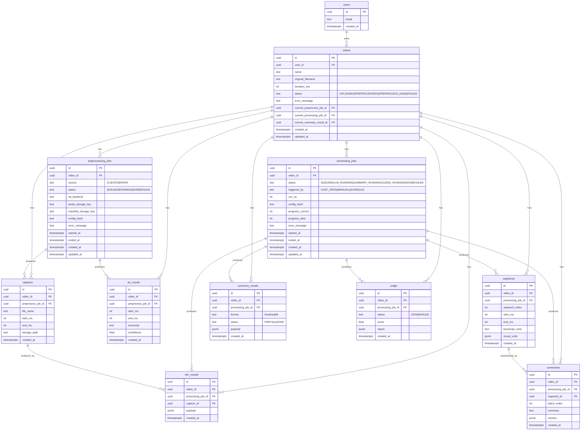
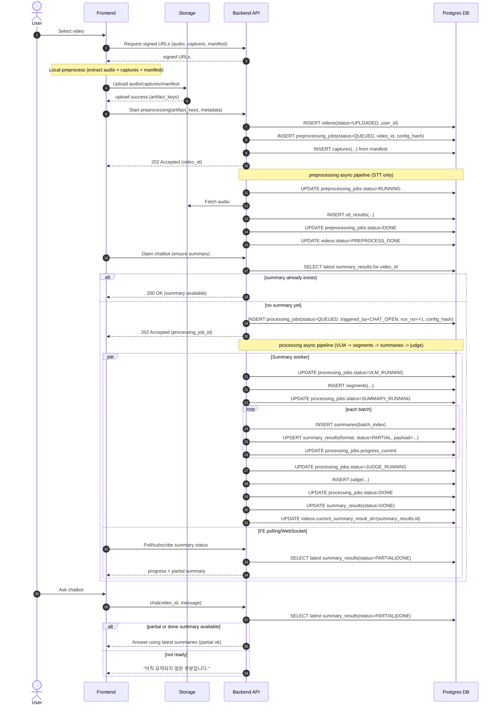
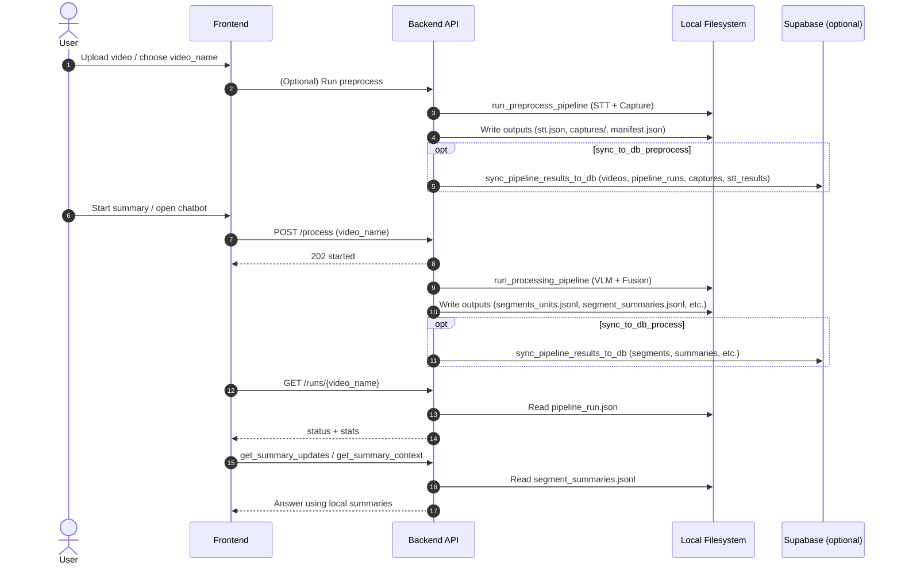
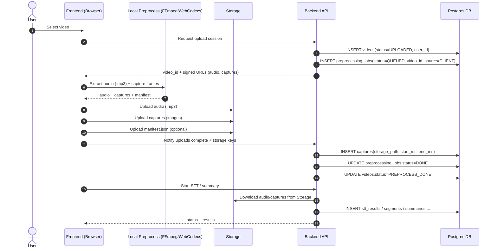

# ERD

# Chatbot 조회 기준 (DB)

- 최신 결과 기준: `videos.current_summary_result_id` 또는 `summary_results`(status=PARTIAL|DONE, video_id)
- 부분 요약 응답: `summaries` + `segments`(transcript_units, visual_units)
- 원문/타임라인 근거: `stt_results`(start_ms, end_ms, transcript)
- 이미지 컨텍스트: `captures.storage_path` (필요 시 렌더)
- 진행 상태: `processing_jobs.status`, `processing_jobs.progress_current/total`

# Sequence Diagram (Future Async - Client Preprocess + Backend STT)

# Sequence Diagram (Current Logic)

# Sequence Diagram (Client-side Preprocess Proposal)

