# Re:View Target Pipeline Timeline (Queue/Event Architecture)

Last updated: 2026-02-05

## Scope
- 이 문서는 `docs/pipeline-plan.md`의 목표 구조를 시각화한 설계 문서입니다.
- 핵심 목표:
  - 캡처가 누적되면 VLM을 즉시 시작
  - STT 완료 이벤트 이후 Fusion 증분 처리
  - Sleep/Poll 중심 구조를 Queue/Event 중심으로 교체

Note:
- 아래 Gantt 시간값(ms)은 **설계 의존성 표현용 예시값**입니다.
- 실제 시간은 모델 응답/쿼터/입력 크기에 따라 달라집니다.

## 1) Target 타임라인 

```mermaid
%%{init: {"themeVariables": {
  "activeTaskBkgColor": "#1E88E5",
  "activeTaskBorderColor": "#1565C0",
  "doneTaskBkgColor": "#9E9E9E",
  "doneTaskBorderColor": "#616161"
}}}%%
gantt
    title Target: Event-Driven Streaming Pipeline
    dateFormat x
    axisFormat %M:%S

    section Capture Producer
    capture chunk-1 ready                    :active, t_cap1, 0, 5000
    capture chunk-2 ready                    :active, t_cap2, 5000, 10000
    capture chunk-3 ready                    :active, t_cap3, 10000, 15000
    capture chunk-4 ready                    :active, t_cap4, 15000, 20000

    section STT Worker
    STT full run*                            :active, t_stt1, 0, 12000
    STT done event                           :active, t_stt2, 12000, 13000

    section VLM Worker Pool
    VLM w1 chunk-1*                          :active, t_v1, 5000, 13000
    VLM w2 chunk-2*                          :active, t_v2, 10000, 18000
    VLM w3 chunk-3*                          :active, t_v3, 15000, 23000
    VLM w1 chunk-4*                          :active, t_v4, 13000, 21000

    section Fusion Worker (single)
    wait STT gate                            :done, t_f0, 0, 12000
    fuse chunk-1*                            :active, t_f1, 13000, 17000
    fuse chunk-2*                            :active, t_f2, 17000, 21000
    fuse chunk-3*                            :active, t_f3, 21000, 25000
    fuse chunk-4*                            :active, t_f4, 25000, 29000

    section Summary/Judge Workers
    sum+judge chunk-1*                       :active, t_sj1, 17000, 24000
    sum+judge chunk-2*                       :active, t_sj2, 21000, 28000
    sum+judge chunk-3*                       :active, t_sj3, 25000, 32000
    sum+judge chunk-4*                       :active, t_sj4, 29000, 36000

    section Frontend Stream
    partial result #1                        :active, t_fe1, 24000, 24500
    partial result #2                        :active, t_fe2, 28000, 28500
    partial result #3                        :active, t_fe3, 32000, 32500
    partial result #4                        :active, t_fe4, 36000, 36500
```

## 2) Current vs Target (타임라인 관점)

| 항목 | Current | Target |
|---|---|---|
| VLM 시작 트리거 | batch loop에서 chunk 확보 후 | capture chunk ready 즉시 |
| Fusion 시작 트리거 | 배치별 VLM 완료 후 순차 | STT gate open + VLM result event |
| 배치 간 대기 | `sleep/poll` 존재 | 이벤트 기반으로 제거/축소 |
| 중간 결과 노출 | 배치 단위 완료 이후 | chunk 단위로 연속 스트리밍 |
| 핵심 병목 | 폴링/직렬 구간 | quota 제한 하의 병렬 파이프 |

## Concurrency Rules (Target)
| 컴포넌트 | 제어 방식 | 이유 |
|---|---|---|
| Capture -> VLM | chunk 단위 Queue | 캡처 즉시 VLM 시작 |
| VLM | `Semaphore(N)` + worker pool | API quota 초과 방지 |
| Fusion | 기본 1 worker (직렬) | segment_id/순서 안정성 |
| Summary/Judge | 독립 Queue + 제한된 workers | Fusion과 분리해 지연 축소 |
| 전체 | backpressure(큐 길이 제한) | 메모리/지연 폭주 방지 |

## Scheduling Policy (Target)

- `VLM start`: `capture_chunk_ready` 즉시
- `Fusion start`: `STT_done_event` 이후, `vlm_result_event` 도착 시마다
- `Summary/Judge start`: `fused_batch_ready` 시마다
- `Frontend update`: batch 완료 이벤트마다 즉시 push

## Gap vs Current

현재(`docs/current-pipeline-timeline.md`) 대비 변경점:
1. STT/캡처/처리를 폴링 기반 순차 루프에서 이벤트 기반으로 전환
2. `time.sleep` 중심 대기 제거
3. 배치 처리 완료까지 기다리지 않고 중간 결과를 연속 노출
