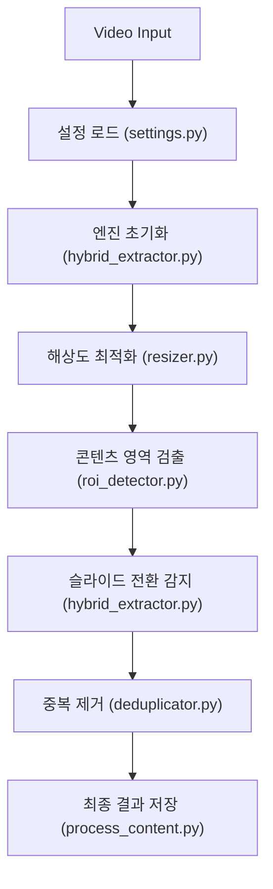

# Capture 모듈 안내

이 문서는 Re:View 프로젝트의 핵심 엔진인 Capture 모듈의 역할과 동작을 설명합니다.

---

## 주요 특징

- **하이브리드 전환 감지**: 픽셀 밝기 변화와 ORB 특징점 유사도를 결합하여 정확한 장면 전환을 감지합니다.
- **Smart ROI (Median Lock)**: 영상 초반 30초 내외의 데이터를 분석하여 불필요한 레터박스를 자동으로 제거하고 실제 콘텐츠 영역만 캡처합니다.
- **적응형 리사이징 (Adaptive Resize)**: 입력 해상도에 따라 최적의 분석 해상도로 자동 조절하여 성능과 정확도의 균형을 맞춥니다.
- **지연 저장 (Delay-Save)**: 슬라이드가 완전히 안정화된 시점에 파일명을 확정하여 저장하므로 불필요한 파일 IO와 이름 변경 오버헤드가 없습니다.

---

## 모듈 구조

### 핵심 파일

- **process_content.py**: 캡처 프로세스의 메인 로직을 관리하는 엔트리포인트입니다. Single Video 프로세싱을 담당하며 `HybridSlideExtractor`를 제어합니다.
- **settings.py**: `config/capture/settings.yaml` 파일을 로드하고 `CaptureSettings` 데이터 클래스로 변환하여 타입 안전한 설정을 제공합니다.

### 도구 모음 (tools/)

- **hybrid_extractor.py**: 캡처 엔진의 핵심입니다. 픽셀 차분과 ORB 특징점을 모두 활용하여 슬라이드 전환을 감지합니다. (`HybridSlideExtractor` 클래스)
- **roi_detector.py**: 영상의 상하단 검은색 여백(Letterbox)을 감지하여 실제 콘텐츠 영역(ROI)만 추출할 수 있게 돕습니다. (`ROIDetector` 클래스)
- **resizer.py**: 입력 영상의 해상도에 따라 지능적으로 분석 크기를 조절하여 성능을 최적화합니다. (`AdaptiveResizer` 클래스)
- **deduplicator.py**: 추출된 슬라이드들 사이의 중복을 판정하고 제거합니다. (`SlideDeduplicator` 클래스)
- **phash_util.py**: pHash(Perceptual Hash) 계산을 위한 유틸리티로, 중복 제거 로직에서 핵심적인 역할을 합니다.

---

## 설정 가이드 (config/capture/settings.yaml)

모든 동작 파라미터는 YAML 파일을 통해 제어됩니다.

| 파라미터 | 기본값 | 설명 |
| :--- | :--- | :--- |
| sample_interval_sec | 1.0 | 분석 프레임 샘플링 간격 (초 단위) |
| persistence_drop_ratio | 0.15 | 슬라이드 종료 판정을 위한 특징점 감소 임계값 (작을수록 민감) |
| enable_smart_roi | true | 중앙값 기반의 안정적인 ROI 추출 활성화 |
| roi_warmup_frames | 30 | Smart ROI 확정 전까지 수집할 프레임 수 |
| enable_adaptive_resize | true | 해상도 기반 자동 다운스케일링 활성화 |
| dedup_phash_threshold | 12 | 중복 슬라이드 제거를 위한 pHash 임계값 |

---

## 파이프라인 실행 흐름

전체 비동기 파이프라인(src/run_pipeline_demo_async.py) 실행 시 Capture 모듈은 다음과 같은 흐름으로 동작합니다.



1. **설정 로드**: `settings.py`가 YAML 설정을 읽어 파이프라인 전반에 공유합니다.
2. **최적화**: `resizer.py`와 `roi_detector.py`가 입력 프레임을 분석하기 가장 좋은 상태로 가공합니다.
3. **감지**: `hybrid_extractor.py` 내부의 하이브리드 알고리즘이 전환 시점을 포착합니다.
4. **정제**: `deduplicator.py`가 `phash_util.py`를 활용해 시각적으로 동일한 슬라이드들을 걸러냅니다.
5. **완료**: `process_content.py`의 로직에 따라 최종 이미지 파일과 `manifest.json`이 생성됩니다.

---

## 사용 방법

### 단독 실행 (테스트 용도)

```bash
python src/capture/process_content.py --video data/inputs/sample.mp4
```

### 비동기 전체 파이프라인 실행 (권장)

```bash
python src/run_pipeline_demo_async.py --video data/inputs/sample.mp4 --sync-to-db
```

> [!TIP]
> 상세 로그가 필요하다면 settings.yaml에서 verbose 옵션을 활용하거나, 각 모듈의 Docstring(Intent, Usage)을 참조하세요.
