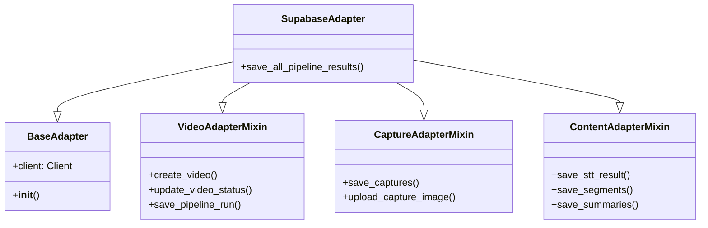

# DB Module Refactoring and Documentation Walkthrough

I have reviewed the `src/db` module and confirmed that it is already well-modularized using a Mixin pattern. I have focused on enhancing the documentation by adding detailed Korean comments to explain the purpose and functionality of each component.

## Architecture Overview

The `SupabaseAdapter` class (`src/db/supabase_adapter.py`) acts as the main entry point, inheriting functionality from specialized mixins located in `src/db/adapters/`.

## Changes Made

### 1. `src/db/adapters/video_adapter.py`
- Added detailed Korean comments to `VideoAdapterMixin`.
- Explained methods for creating videos, updating status, and saving pipeline runs.
- **Key Insight**: Explained the duplicate check logic in `get_video_by_filename`.

### 2. `src/db/adapters/capture_adapter.py`
- Added detailed Korean comments to `CaptureAdapterMixin`.
- Clarified the relationship between DB metadata storage (`captures` table) and Storage file upload (Private bucket).
- **Key Insight**: Explained the `save_captures_with_upload` workflow which handles both image upload and DB insertion.

### 3. `src/db/adapters/content_adapter.py`
- Added detailed Korean comments to `ContentAdapterMixin`.
- Explained how hierarchical JSON data (from STT/Segments) is flattened into relational DB rows.
- **Key Insight**: Detailed the `segment_map` logic used to link Summaries to Segments via Foreign Keys.

### 4. `src/db/supabase_adapter.py`
- Documented the main `SupabaseAdapter` class and its Mixin inheritance.
- Added a detailed process flow description to `save_all_pipeline_results`.
- **Key Insight**: Only this file needs to be imported by the pipeline; it exposes all necessary methods.

### 5. `src/db/pipeline_sync.py`
- Documented the `sync_pipeline_results_to_db` function.
- Explained the high-level workflow: Connection -> Video Creation -> Metadata Save -> Content Upload.

## Verification
- Ran a python script to verify that `SupabaseAdapter` imports correctly without syntax errors.
- Confirmed that all methods have Korean docstrings as requested.

The code is now fully documented and ready for team review.
