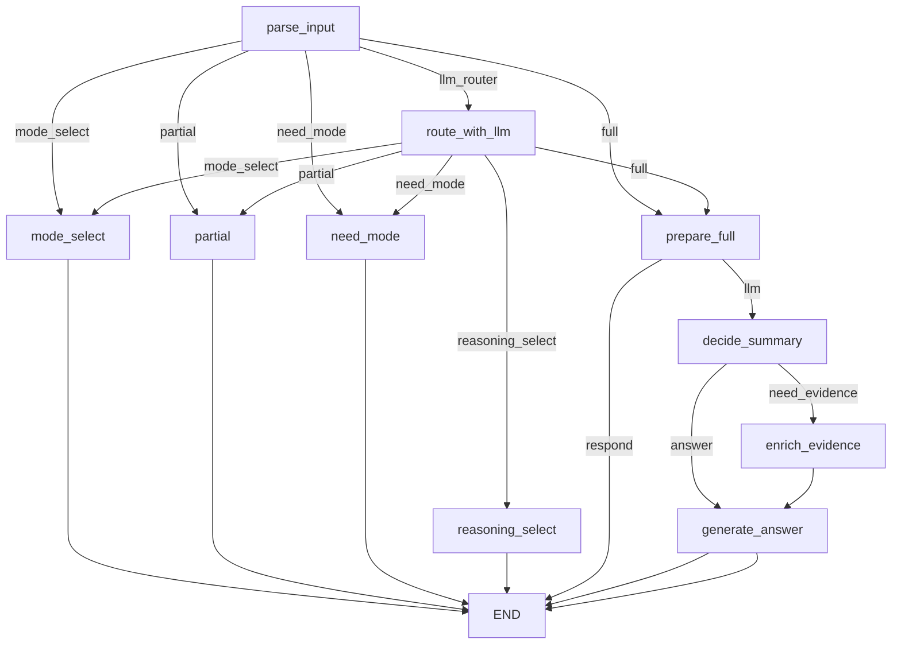

# ADK vs LangGraph (현재 구현 기준)

## 공통 로직 (요약/답변 흐름)
- 모드 선택 후 `full`이면 요약 상태 확인 → 필요 시 `/process`로 요약 작업 시작.
- 요약 목록은 `/videos/{video_id}/summaries`로 가져오고, 세션 상태에 `summary_cache`, `pending_updates`, `last_segment_id`로 관리.
- 시간 태그(`[time_ms=...]`)가 있으면 해당 구간만 필터해서 답변, 없으면 전체 요약을 사용.
- LLM 입력은 `summary_cache/answer_records`를 JSON으로 만든 프롬프트 텍스트.

## DB 응답 조립 방식 (중요)
- `/videos/{video_id}/summaries` 응답은 DB의 `summaries + segments`를 조인해서 가져온 뒤,
  챗봇에 필요한 필드만 조립해서 내려줌.
- `summaries`에서 사용하는 필드: `segmend_id`, `summary`
- `segments`에서 사용하는 필드: `start_ms`, `end_ms`
- 즉, DB 컬럼 전체가 그대로 노출되는 구조가 아니라, API에서 “필요한 값만 뽑아서” 응답 형식을 만든다.

## 차이점 (참고)
- **흐름 제어**: ADK는 agent/툴 기반, LangGraph는 고정 그래프 노드 기반.
- **데이터 소스**: ADK는 DB 우선 + 로컬 `segment_summaries.jsonl` fallback, LangGraph는 DB 전용(필수 `video_id`).
- **증거(evidence)**: LangGraph는 요약의 `source_refs(stt_ids/vlm_ids)`를 기반으로 DB evidence를 조회해 결합. 로컬 파일 evidence는 사용하지 않음.
- **LLM 호출**: ADK는 `google.adk` Agent, LangGraph는 직접 `google.genai` 호출.
- **세션 관리**: ADK는 `InMemoryRunner` 이벤트 스트림, LangGraph는 `LangGraphSession` 내부 상태 dict.

## LangGraph 정보
### Router 옵션
- 기본값은 규칙 기반 라우팅(`CHATBOT_ROUTER=rules`).
- `CHATBOT_ROUTER=llm` 설정 시, LLM이 `mode_select / reasoning_select / full / partial / need_mode` 중 하나를 선택해 분기.
- LLM 라우팅은 `parse_input` 이후 `route_with_llm` 노드를 추가로 거친 뒤 기존 노드로 이동.

### Nodes
- parse_input: parse user message, mode selection, time tag, detail intent
- route_with_llm: LLM 라우팅 선택(옵션, `CHATBOT_ROUTER=llm`)
- mode_select: set chat_mode, ensure summary exists for full mode
- need_mode: prompt user to choose mode
- partial: placeholder (not implemented)
- prepare_full: fetch updates, build summary cache (summary-only)
- decide_summary: 요약만으로 답변 가능한지 판단(answer/need_evidence). thinking은 항상 need_evidence로 보강.
- enrich_evidence: summary의 source_refs(stt_ids/vlm_ids)로 DB evidence 조회 및 결합
- generate_answer: build prompt, call LLM, update history

### Edges
- entry: parse_input
- (rules) parse_input -> mode_select (intent == "mode_select")
- (rules) parse_input -> partial (chat_mode == "partial")
- (rules) parse_input -> prepare_full (chat_mode == "full")
- (rules) parse_input -> need_mode (no mode selected)
- (llm) parse_input -> route_with_llm -> {mode_select|reasoning_select|partial|prepare_full|need_mode}
- prepare_full -> END (response already available)
- prepare_full -> decide_summary (needs LLM)
- decide_summary -> enrich_evidence -> generate_answer (need_evidence)
- decide_summary -> generate_answer (answer)
- mode_select -> END
- need_mode -> END
- partial -> END
- generate_answer -> END

### 모드별 동작 요약
- flash: decide_summary에서 요약만으로 충분한지 판단 → 부족하면 evidence(STT/VLM) 보강
- thinking: 시작부터 evidence(STT/VLM) 보강 (summary 판단 없이 곧바로 need_evidence)

### Mermaid

