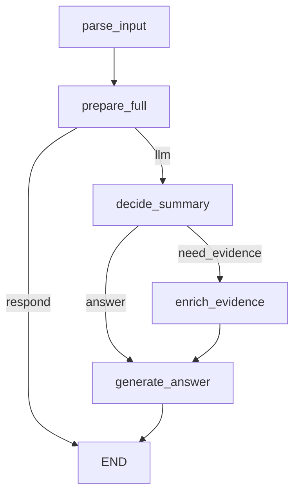

# ADK vs LangGraph (현재 구현 기준)

## 공통 로직 (요약/답변 흐름)
- 현재 배포 버전은 `full` 고정이며, `prepare_full`에서 요약 업데이트/컨텍스트를 가져온다.
- 요약 목록은 `/videos/{video_id}/summaries`로 가져오고, 세션 상태에 `summary_cache`, `pending_updates`, `last_segment_id`로 관리.
- 시간 태그(`[time_ms=...]`)가 있으면 해당 구간만 필터해서 답변, 없으면 전체 요약을 사용.
- LLM 입력은 `summary_cache/answer_records`를 JSON으로 만든 프롬프트 텍스트.

## DB 응답 조립 방식 (중요)
- `/videos/{video_id}/summaries` 응답은 DB의 `summaries + segments`를 조인해서 가져온 뒤,
  챗봇에 필요한 필드만 조립해서 내려줌.
- `summaries`에서 사용하는 필드: `segmend_id`, `summary`
- `segments`에서 사용하는 필드: `start_ms`, `end_ms`
- 즉, DB 컬럼 전체가 그대로 노출되는 구조가 아니라, API에서 “필요한 값만 뽑아서” 응답 형식을 만든다.

## 차이점 (참고)
- **흐름 제어**: ADK는 agent/툴 기반, LangGraph는 고정 그래프 노드 기반.
- **데이터 소스**: ADK는 DB 우선 + 로컬 `segment_summaries.jsonl` fallback, LangGraph는 DB 전용(필수 `video_id`).
- **증거(evidence)**: 현재 배포 버전의 LangGraph 그래프는 evidence 보강 노드를 사용하지 않는다.
- **LLM 호출**: ADK는 `google.adk` Agent, LangGraph는 직접 `google.genai` 호출.
- **세션 관리**: ADK는 `InMemoryRunner` 이벤트 스트림, LangGraph는 `LangGraphSession` 내부 상태 dict.

## LangGraph 정보
### 현재 배포용 그래프
- `full` 고정, 라우팅/모드 선택 노드 제거(최소 노드 구성).

### Nodes
- parse_input: 입력 정리(시간 태그/시간 표현 파싱 등)
- prepare_full: 요약 업데이트/컨텍스트 조회, answer_records 구성
- decide_summary: 요약만으로 답변 가능한지 판단(answer/need_evidence). thinking은 항상 need_evidence로 보강.
- enrich_evidence: summary의 source_refs(stt_ids/vlm_ids)로 DB evidence 조회 및 결합
- generate_answer: 프롬프트 생성 → LLM 호출 → history 갱신

### Edges
- entry: parse_input
- prepare_full -> END (response already available)
- prepare_full -> decide_summary (needs LLM)
- decide_summary -> enrich_evidence -> generate_answer (need_evidence)
- decide_summary -> generate_answer (answer)
- generate_answer -> END

### Mermaid

