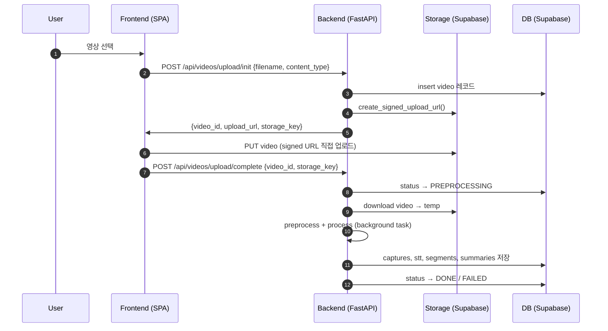
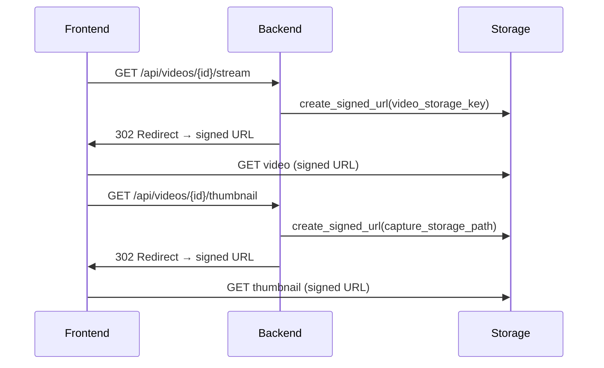
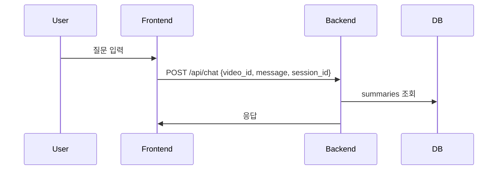

# Screentime MVP Architecture

## 배포 구조

```
User → Frontend (SPA, Vercel) → Backend (단일 FastAPI) → DB (Supabase)
                               → Storage (Supabase, Signed URL 직접 업로드)
```

## 영상 업로드 흐름 (Signed URL)



## 영상 스트리밍/썸네일



## 채팅 흐름



## 주요 컴포넌트

| 컴포넌트 | 기술 | 역할 |
|---------|------|------|
| Frontend | React + Vite (Vercel) | SPA, 영상 업로드/재생/요약 표시 |
| Backend | FastAPI (단일 서버) | API, 파이프라인 실행, Storage/DB 연동 |
| DB | Supabase PostgreSQL | videos, captures, stt_results, segments, summaries |
| Storage | Supabase Storage | videos 버킷 (영상), captures 버킷 (썸네일) |

## 환경변수

### Frontend (Vite)
- `VITE_API_BASE_URL` — 백엔드 API URL (개발: 빈 문자열 → Vite 프록시, 프로덕션: 절대 URL)

### Backend
- `SUPABASE_URL` — Supabase 프로젝트 URL
- `SUPABASE_KEY` — Supabase anon/service key
- `CORS_ORIGINS` — 허용 origin 목록 (쉼표 구분, 기본: `http://localhost:5173,http://localhost:5174`)
